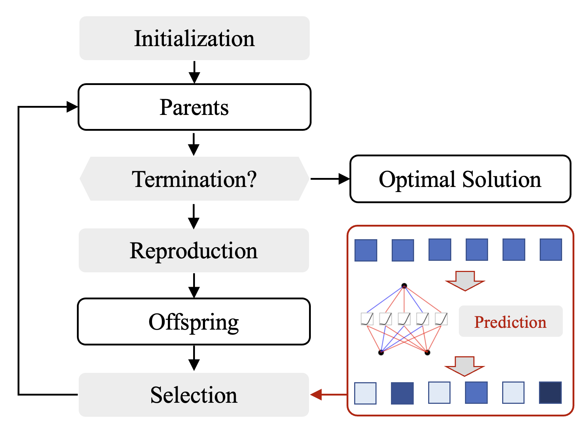

# A First Look at Kolmogorov-Arnold Networks in Surrogate-assisted Evolutionary Algorithms

This project uses Kolmogorov-Arnold Networks (KANs) within Surrogate-assisted Evolutionary Algorithms (SAEAs) to efficiently solve black-box optimization problems by reducing the dependency on function evaluations. The code supports the use of KANs for regression and classification, improving optimization efficiency through solution selection, thus curtailing function calls. The experiments prove the model's effective integration, showcasing enhanced performance in optimization tasks.

  

---
