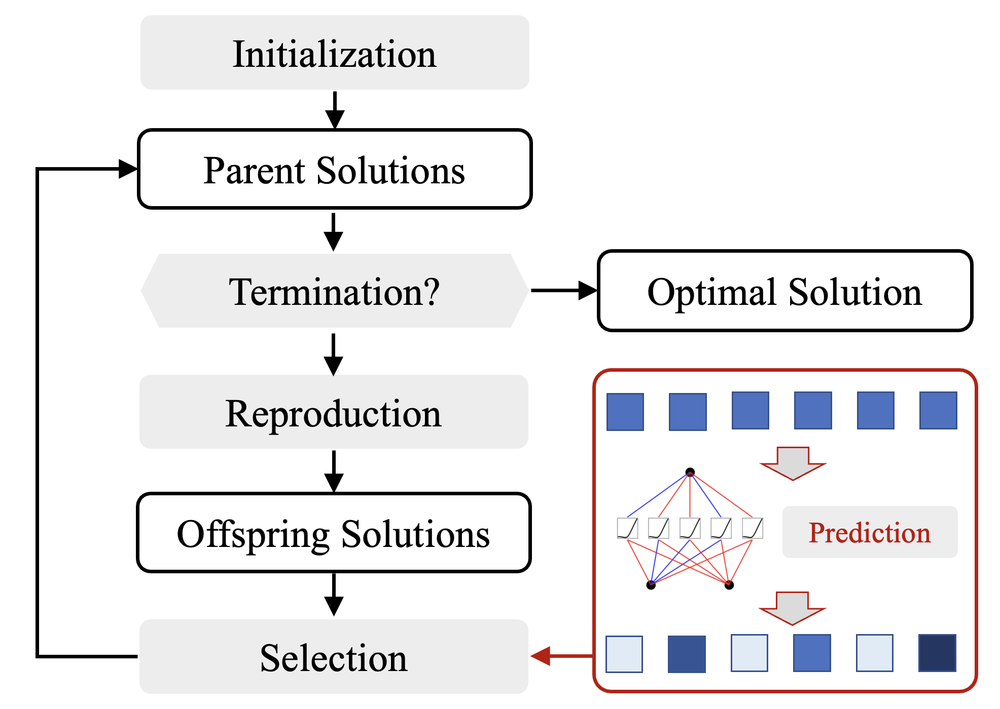

# A First Look at Kolmogorov-Arnold Networks in Surrogate-assisted Evolutionary Algorithms


This project uses `Kolmogorov-Arnold Networks (KANs)` within `Surrogate-assisted Evolutionary Algorithms (SAEAs)` to efficiently solve black-box optimization problems by reducing the dependency on function evaluations. The code supports the use of KANs for regression and classification, improving optimization efficiency through model assisted selection, thus curtailing function calls. The experiments prove the model's effective integration, showcasing enhanced performance in optimization tasks.
<p align="center">
  
</p>

---

## Installation

```
cd KAN-EA
conda create -n KANEA python=3.10
conda activate KANEA
pip install -r requirements.txt
python setup.py develop

python run_kan_sps.py
```


---

## KANs pre-selection for EA
run KAN-SPS on Ellipsoid function
```python
from pymoo.optimize import minimize

from problem.LZG import LZG01
from model.KAN_surrogate import KAN_Regressor,KAN_Classifier
from alg.pre_selection import KAN_SPS

problem = LZG01(n_var=5)

model = KAN_Regressor()   # USE KAN_Regressor or KAN_Classifier
# model = KAN_Classifier()  
    
algorithm = KAN_SPS(problem=problem, 
                    pop_size=50, 
                    n_offsprings=50, 
                    reproduction_type="CoDE", 
                    trial_vectors_num=3,
                    model=model
                    )

res = minimize(problem,
                algorithm,
                ('n_evals', 2000),
                verbose=True)

```

## KANs assisted EA

run KAN-SAS on Ellipsoid function
```python

from problem.LZG import LZG01
from pymoo.optimize import minimize

from alg.ueda import KAN_SAS


if __name__=='__main__':

    problem = LZG01(n_var=5)

    algorithm = KAN_SAS(pop_size=50)


    res = minimize(problem,
                   algorithm,
                   ('n_evals', 300),
                   verbose=True)
```


---

## Limitations:

The current training process of the KANs model is quite time-consuming and has poor compatibility on CUDA. For efficiency, you can refer to some efficient implementations in [awesome-kan](https://github.com/mintisan/awesome-kan) project.

---
## Cite this work:

```
@misc{hao2024look,
      title={A First Look at Kolmogorov-Arnold Networks in Surrogate-assisted Evolutionary Algorithms}, 
      author={Hao Hao and Xiaoqun Zhang and Bingdong Li and Aimin Zhou},
      year={2024},
      eprint={2405.16494},
      archivePrefix={arXiv},
      primaryClass={cs.NE}
}
```
